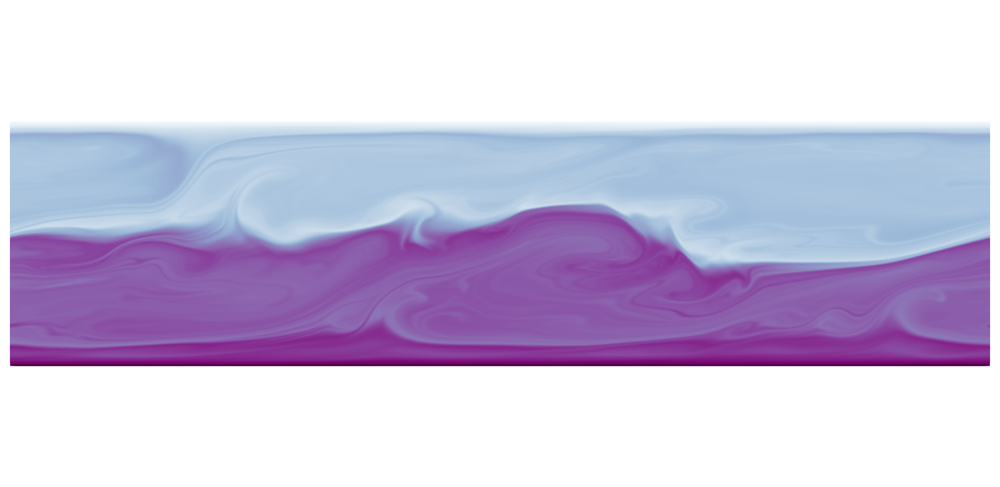

<h2 style="text-align:center;">Channelflow-DDC: An Extension Module of Channelflow 2.0</h2>



This is an extension module of Channelflow 2.0 for wall-bounded double-diffusive problems, which has governing equations:

$$\begin{align}
    \nabla \cdot \boldsymbol{U} &= 0,\\
    \frac{\partial \boldsymbol{U}}{\partial t} + \boldsymbol{U} \cdot \nabla \boldsymbol{U} &= -\nabla P + p_1\nabla^2\boldsymbol{U}+ p_2(p_3 T - p_4 S) (\sin{\gamma}\hat{\mathbf{e}}_x+\cos{\gamma}\hat{\mathbf{e}}_y),\\
    \frac{\partial T}{\partial t} + \boldsymbol{U} \cdot \nabla T &= p_5\nabla^2 T,\\
    \frac{\partial S}{\partial t} + \boldsymbol{U} \cdot \nabla S &= p_6 \nabla^2 S + p_7\nabla^2 T,
\end{align}$$

where $\boldsymbol{U}$, $T$, and $S$ are the total velocity, first scalar (temperature/density), and second scalar (salinity/concentration) fields, respectively. The $\gamma$ is the inclined angle between downward vertical direction and gravity $\boldsymbol{g}=g\hat{\boldsymbol{g}}=g(\sin{\gamma}\hat{\mathbf{e}}_x+\cos{\gamma}\hat{\mathbf{e}}_y)$. Also, $p_i$ is controlling parameter to define the given governing equations via a header file `ddc/macros.h`. We suggest some wall-bounded fluid flow systems as:

| Parameters | Double-diffusive convection $U_f=\kappa_T/H$ (Singh & Srinivasan [2014](https://doi.org/10.1063/1.4882264)) | Sheared double-diffusive convection $U_f=\sqrt{g\alpha\Delta_T H}$ (Yang et al. JFM [2021](https://doi.org/10.1017/jfm.2021.1091)) | Sheared double-diffusive convection $U_f=U_w$| Binary fluid convection $U_f=\kappa_T/H$ (Mercader et al. JFM [2013](https://doi.org/10.1017/jfm.2013.77)) | Stratified plane Couette flow $U_f=U_w$ (Langham et al. JFM [2019](https://doi.org/10.1017/jfm.2019.811)) | Inclined layer convection $U_f=\sqrt{g\alpha\Delta_T H}$ (Zheng et al. JFM [2024](https://doi.org/10.1017/jfm.2024.842)) | 
|:------|:--------|:----------|:----------|:----------|:-----------|:-----------|
| $p_1$ | $Pr$  | $\sqrt{\frac{Pr}{Ra}}$ | $1/Re$ | $Pr$ | $1/Re$ | $\sqrt{\frac{Pr}{Ra}}$ | 
| $p_2$ | $Pr Ra$  | $1$  | $\frac{Ri}{\Lambda-1}$ | $Pr Ra$ | $Re$ | $1$ | 
| $p_3$ | $1$  | $1$  | $1$ | $1+R_{sep}$ | $-Ri$ | $1$ | 
| $p_4$ | $1/R_\rho$ | $\Lambda$ | $\Lambda$ | $R_{sep}$ |  |  | 
| $p_5$ | $1$  | $\frac{1}{\sqrt{Pr Ra}}$  | $\frac{1}{RePr}$ | $1$ | $\frac{1}{RePr}$ |$\frac{1}{\sqrt{Pr Ra}}$ | 
| $p_6$ | $1/Le$ |$\frac{1}{Le\sqrt{Pr Ra}}$ | $\frac{1}{LeRePr}$ | $1/Le$ | | |
| $p_7$ |   |   |   | $1$  | | | 

Here, $U_f$ is the reference velocity. Dimensionless parameters are:
- $Ri$ is the Richardson number 
- $Re=U_w H/\nu$ is the Reynolds number
- $Pr=\nu/\kappa_T$ is the Prandtl number
- $Ra=\frac{g\alpha \Delta_T H^3}{\nu\kappa_T}$ is the Rayleigh number
- $R_\rho=1/\Lambda=\frac{\alpha\Delta_T}{\beta\Delta_S}$ is the Density stability ratio 
- $R_{sep}$ is the Separation ratio 
- $Le=1/\tau=\kappa_T/\kappa_S$ is the Lewis number 

A correct defination looks like this
```cpp
// Example: Moving-wall-bounded double-diffusive convection
// Velocity is normalized by free-fall velocity $U_f=\sqrt{g\alpha\Delta_T H}$
#define P1 sqrt(Pr/Ra) 
#define P2 1.0
#define P3 1.0
#define P4 Rrho
#define P5 1.0/sqrt(Pr*Ra)
#define P6 1.0/(Le*sqrt(Pr*Ra))
```
Notes that if you don't define $p_5$ or $p_6$, scalar's governing equations and their buoyancy components ($p_3$, $p_4$) in momentum equations will be removed automatically. Let's create your governing equations.

### Installation

Read [this](docs/INSTALL.md) to install and set up required libraries of the module on a [HPC](docs/HPCsetup.md). To install the code, first you need to clone code of Channelflow and this repo to your local machine
```bash
git clone --depth=1 https://github.com/ducnguyen-uconn/ChannelFlow-DoubleDiffusiveConvection.git

cd ./ChannelFlow-DoubleDiffusiveConvection
git clone --depth=1 https://github.com/epfl-ecps/channelflow.git
cp ./CMakeLists.txt ./channelflow/CMakeLists.txt
mkdir -p ./channelflow/modules/
rm -rf ./channelflow/modules/ddc
cp -r ./ddc ./channelflow/modules/ddc

mkdir -p build
cd build
cmake ../channelflow -DCMAKE_CXX_COMPILER=/usr/bin/mpicxx -DWITH_DDC=ON -DWITH_NSOLVER=ON -DCMAKE_BUILD_TYPE=release -DCMAKE_INSTALL_PREFIX=/user/local/ -DCMAKE_CXX_FLAGS_RELEASE:STRING=" -fPIC -lfftw3 -lm -Wno-unused-variable " -DWITH_SHARED=OFF -DWITH_HDF5CXX=OFF
make -j16
```


A exact executable command likes this:
```bash
mpiexec -n <ncpu> ./<exename> <option1> <option2> ...
```
with a few parameters:

|Option  | Default   | Description |
|:------------------------|:----------|:------------------------------------------------------------------|
|`-Nx <value>`| $200$| Number of points along x-direction |
|`-Ny <value>`| $101$ | Number of points along y-direction, notes that $N_y$ is odd number |
|`-Nz <value>`| $6$ | Number of points along z-direction, minimal number is 6 ( can be used for 2D setup) |
|`-Lx <value>`| $2$| Streamwise length |
|`-Lz <value>`| $0.004$ | Spanwise length, default setup is a small length representing 2D domain |
|`-Pr <value>` | $10$ | Prandtl number $Pr=\frac{\nu}{\kappa_T}$|
|`-Ra <value>`| $10^3$ | Thermal Rayleigh number $Ra_T=\frac{g\alpha\Delta T H^3}{\nu\kappa_T}$|
|`-Le <value>`| $100$ | Lewis number $Le=\frac{\kappa_T}{\kappa_S}$ |
|`-Rr <value>`| $2$ | Density stability ratio $R_\rho=\frac{\alpha \Delta T}{\beta \Delta S}$ |
|`-Ua <value>`| $0$ | X-velocity at lower wall, U(y=a) |
|`-Ub <value>`| $0$ | X-velocity at upper wall, U(y=b) |
|`-Wa <value>`| $0$ | Z-velocity at lower wall, W(y=a) |
|`-Wb <value>`| $0$ | Z-velocity at upper wall, W(y=b) |
|`-Ta <value>`| $0$ | Temperature at lower wall, T(y=a) |
|`-Tb <value>`| $1$ | Temperature at upper wall, T(y=b) |
|`-Sa <value>`| $0$ | Salinity at lower wall, S(y=a) |
|`-Sb <value>`| $1$ | Salinity at upper wall, S(y=b) |
|`-T0 <value>`| $0$ | Start time of DNS |
|`-T <value>`| $20$ | Final time of DNS |
|`-dt <value>`| $0.03125$ | Timestep |
|`-dT <value>`| $1$ | Save interval |
|`-nl <value>`| "rot" | Method of calculating  nonlinearity, one of [rot\|conv\|div\|skew\|alt\|linear] |


Examples:
```bash
# create random states as initial conditions
mpiexec -n 16 ./build/modules/ddc/tools/ddc_initialfield -Nx 96 -Ny 31 -Nz 6 -Lx 2 -ymin -0.5 -ymax 0.5 -Lz 0.004 iniU iniT iniS
# run a 2D simulation from initial conditions
mpiexec -n 16 ./build/modules/ddc/programs/ddc_simulateflow -Pr 10 -Ra 1000 -Le 100 -Rr 2 -Ua 0 -Ub 0 -Ta 0.5 -Tb -0.5 -Sa 0.5 -Sb -0.5 -dt 0.02 -dT 1 -T 100  iniU iniT iniS
# find equilibrium solution based on guess fields as initial condition in inclined angle of 90
mpiexec -n 16 ./build/modules/ddc/programs/ddc_findsoln -eqb -Nn 100 -Pr 0.71 -Ra 6000 -Le 100 -Rr 2 -GammaX 90 -Ua 0 -Ub 0 -Ta 0.5 -Tb -0.5 -Sa 0.5 -Sb -0.5 -symms symms.asc guessU guessT guessS
# run parameter continuation (for equilibrium points) of Ra in [5500,14000] with step of 100
mpiexec -n 16 ./build/modules/ddc/programs/ddc_continuesoln -eqb -cont Ra -dmu 100 -targ -targMu 14000 -Ra 5500 -Pr 0.71 -Le 100 -Rr 2 -GammaX 90 -Ua 0 -Ub 0 -Ta 0.5 -Tb -0.5 -Sa 0.5 -Sb -0.5 -symms symms.asc guessU guessT guessS
```